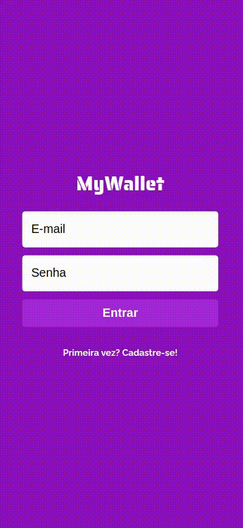

# My Wallet

## Sobre

O My Wallet é uma ferramenta de controle financeiro. 
Com ele, você pode computar seus gastos e ganhos, sendo possível alterar e remover transações.

  

Abaixo, você encontra algumas funções implementadas:

- Cadastro
- Login
- Lista com todas as transações do usuário (ganhos e gastos)
- Adicionar entradas e saídas
- Modificar transação
- Remover transação

Ao utilizar essa aplicação, o usuário pode aprender a controlar sua vida financeira de maneira rápida e simples.

## Como rodar:

1. Clonar esse repositório
2. Seguir as instruções do repositório do back-end em: https://github.com/LuizFelipeSR97/My-Wallet/tree/main/Backend
3. Seguir as instruções do repositório do front-end em: https://github.com/LuizFelipeSR97/My-Wallet/tree/main/Frontend

Aproveite!
